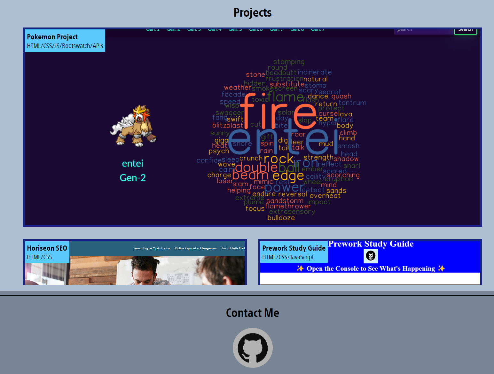

# Projects-Portfolio

## Description

My Projects portfolio showcases projects that I've built and worked on that exercised core concepts in HTML, CSS, and Javascript. The portfolio includes an "About Me" section which contains information about myself, a "Projects" section showing projects that I've either built from scratch or refactored, and a "Contact" section where information can be found to reach me. This portfolio will provide employers a convenient way to view my work when considering me for employment opportunities.

[Portfolio](https://codehashira28.github.io/Projects-Portfolio/)

## Installation

N/A

## Usage

The portfolio is a responsive webpage with navigational links at the top of the page that can be used to quickly navigate to any section of the portfolio. Projects in the "Projects" section are organized, clickable links that will navigate the user to the deployed application once clicked, and the "Contact" section contains a clickable logo that links to my Github repositories. In the projects section, you will find a featured. major project displayed the largest, and smaller projects underneath.

## Credits

N/A